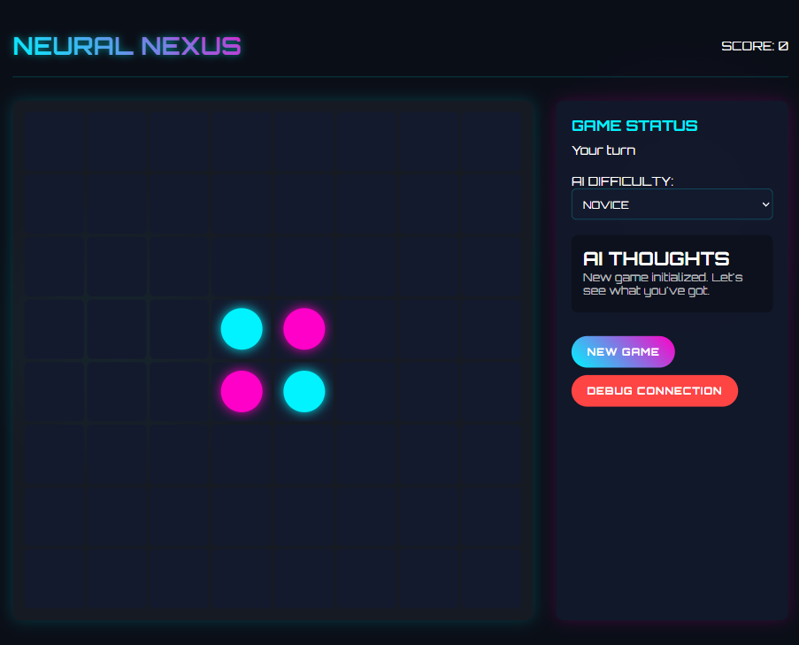
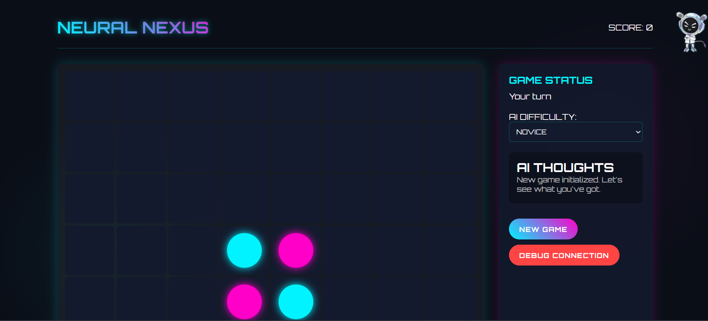
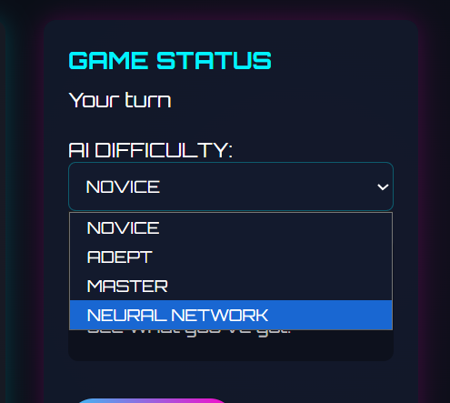
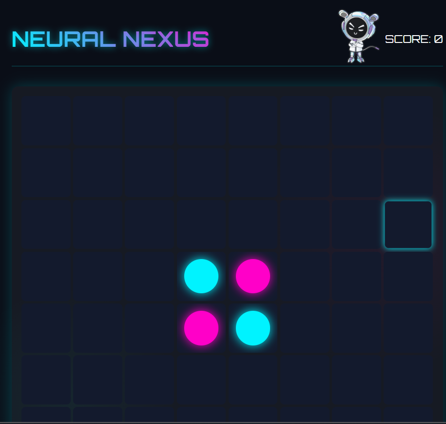

# Neural Nexus 🧠 - AI Strategy Game

    

A futuristic AI strategy game where you challenge increasingly intelligent neural networks in a battle of wits! 🎮✨

 
*Replace with actual screenshot from your game*

## 🚀 Features

- 🤖 **Four AI Difficulty Levels**: From Novice to Neural Network
- 🎯 **Strategic Gameplay**: Classic board game with futuristic twist
- 🎨 **Cyberpunk Design**: Immersive neon visuals and animations
- 💭 **Real-time AI Thoughts**: See what the AI is thinking
- 🏆 **Scoring System**: Track your performance against AI opponents
- 📱 **Responsive Design**: Play on desktop or mobile devices
- 🌐 **Browser-Based**: No installation required - play instantly!

## 🎮 How to Play

1. **Place your piece** on the game board by clicking any empty cell with a dot
2. **Flip your opponent's pieces** by surrounding them with your own
3. **Dominate the board** by having the most pieces when no moves remain
4. **Choose your challenge** from four AI difficulty levels:

   - 🟢 **NOVICE**: Perfect for learning the game
   - 🔵 **ADEPT**: A worthy opponent for casual play
   - 🟠 **MASTER**: Strategic and challenging
   - 🔴 **NEURAL NETWORK**: Nearly unbeatable AI

## 🕹️ Live Demo

Experience the game right now at:  
👉 **[https://sukh2022.github.io/Neural-Nexus/](https://sukh2022.github.io/Neural-Nexus/)**

## 🧠 AI Difficulty Explained

- **NOVICE**: Makes random valid moves with minimal delay
- **ADEPT**: Prefers center positions for better board control
- **MASTER**: Actively looks for capturing opportunities
- **NEURAL NETWORK**: Calculates moves that maximize piece capture and prioritizes strategic positions

## 🛠️ Development

This is a pure JavaScript implementation with no backend requirements. The entire game runs in your browser!

### Technologies Used
- **HTML5** for structure
- **CSS3** with custom properties and animations for the cyberpunk aesthetic
- **Vanilla JavaScript** ES6+ for game logic and AI
- **Google Fonts** (Orbitron) for the futuristic typography

## 📸 Screenshots

| Game Board | Difficulty Levels | Mobile View |
|------------|-------------|-------------|
|  |  |  |

*Replace with actual screenshots from your game*

## 🌐 Browser Compatibility

| Browser | Status |
|---------|--------|
| Chrome  | ✅ Full support |
| Firefox | ✅ Full support |
| Safari  | ✅ Full support |
| Edge    | ✅ Full support |
| Mobile  | ✅ Responsive design |

## 🤝 Contributing

Contributions are welcome! Feel free to:
1. Fork the project
2. Create a feature branch
3. Commit your changes
4. Open a Pull Request

### Ideas for Improvement
- Add sound effects and background music
- Implement game replay/save feature
- Add player vs player mode
- Create a tutorial for new players
- Add more AI personality and dialogue

## 🙋‍♂️ Support

If you have any questions or issues, please open an issue on GitHub or contact [Sukh2022](https://github.com/Sukh2022).

---

⭐ **Star this repo if you like the game!**

🧠 **Challenge yourself against the Neural Nexus today at [https://sukh2022.github.io/Neural-Nexus/](https://sukh2022.github.io/Neural-Nexus/)**

---

*Neural Nexus is a browser-based implementation of the classic Reversi/Othello game with AI opponents and a cyberpunk aesthetic.*